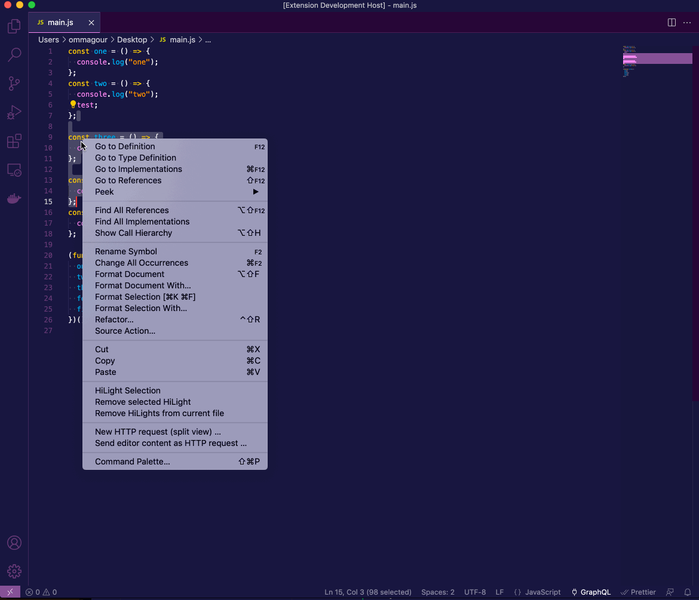
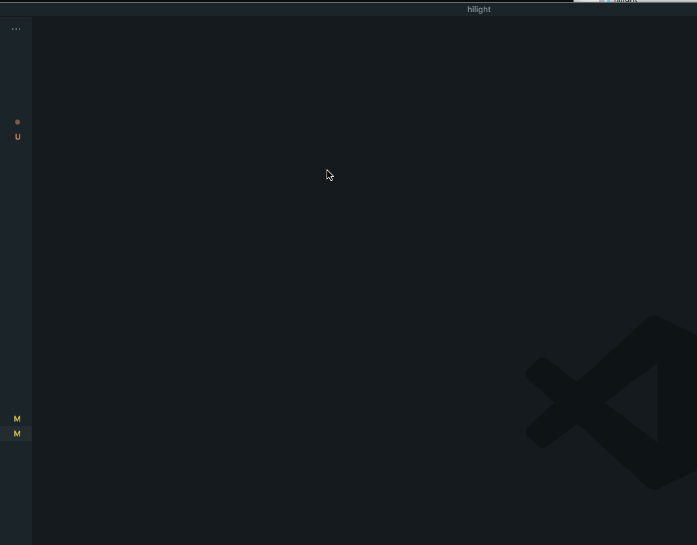

# HiLight

### VSCode extension for highlighting a selected range(s) from a file.
 

### NOTE:

I just thought having such a feature would be useful when navigating between   multiple (big) files for whatever reasons, mostly debugging. So I made this.  
You can find it under the name of `HiLight` on vscode extensions marketplace.
 
Or [go to this link](https://marketplace.visualstudio.com/items?itemName=f0lio.hilight).
 

## Demo:

 

## Use Your Own Colors
Open vscode command palette (SHIFT + CMD + P) type `settings json`
 

 

## _*NOTE*_:

The extension is still under development, and has very basic functionalities . 
However, you may also suggest changes by forking this repo and creating a pull request or opening an issue.